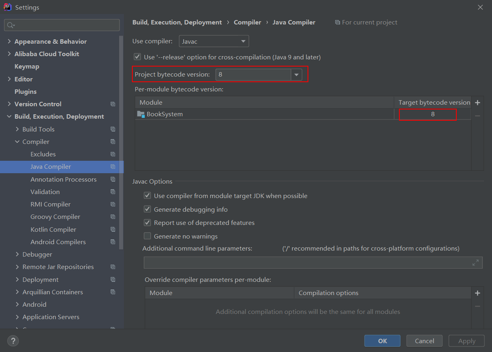
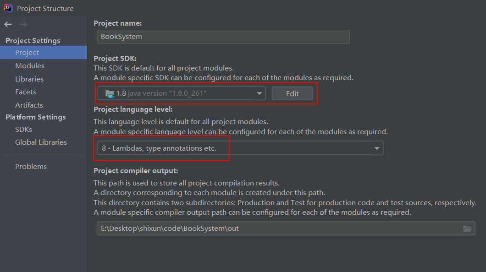
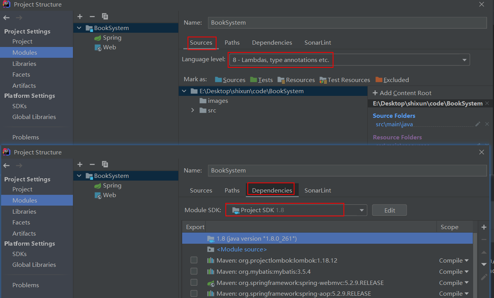

# BookSystem
图书管理系统，跟孙老师学习

# 软件
idea2020、MySQL8

# 出错

## Error:java: Compilation failed: internal java compiler error

> 转自[脚本之家](https://www.jb51.net/)：https://www.jb51.net/article/149422.htm

**解决方法：**

**1.setting中设置**



**2.Project Structure中Project设置**



**3.Project Structure中Modules设置**



**还有一种情况是因项目过大，需要修改这个堆的大小**

解决方法如下：在setting-->Build,Execution,Deployment-->Compiler 中找到build process heap size(Mbytes):700改为1024（视情况而定）

## HTTP状态 500 - 内部服务器错误

```java
类型 异常报告
消息 Request processing failed; nested exception is org.apache.ibatis.binding.BindingException: Invalid bound statement (not found): com.ssm.dao.UCenterMapper.login
描述服务器遇到一个意外的情况，阻止它完成请求。
例外情况
    org.springframework.web.util.NestedServletException: Request processing failed; nested exception is org.apache.ibatis.binding.BindingException: Invalid bound statement (not found): com.ssm.dao.UCenterMapper.login
	org.springframework.web.servlet.FrameworkServlet.processRequest(FrameworkServlet.java:1014)
	org.springframework.web.servlet.FrameworkServlet.doPost(FrameworkServlet.java:909)
	javax.servlet.http.HttpServlet.service(HttpServlet.java:652)
	org.springframework.web.servlet.FrameworkServlet.service(FrameworkServlet.java:883)
	javax.servlet.http.HttpServlet.service(HttpServlet.java:733)
	org.apache.tomcat.websocket.server.WsFilter.doFilter(WsFilter.java:53)
	org.springframework.web.filter.CharacterEncodingFilter.doFilterInternal(CharacterEncodingFilter.java:201)
	org.springframework.web.filter.OncePerRequestFilter.doFilter(OncePerRequestFilter.java:119)
        
根本原因。
org.apache.ibatis.binding.BindingException: Invalid bound statement (not found): com.ssm.dao.UCenterMapper.login
	org.apache.ibatis.binding.MapperMethod$SqlCommand.<init>(MapperMethod.java:235)
	org.apache.ibatis.binding.MapperMethod.<init>(MapperMethod.java:53)
	org.apache.ibatis.binding.MapperProxy.lambda$cachedInvoker$0(MapperProxy.java:107)
	java.util.concurrent.ConcurrentHashMap.computeIfAbsent(ConcurrentHashMap.java:1660)
	org.apache.ibatis.binding.MapperProxy.cachedInvoker(MapperProxy.java:94)
	org.apache.ibatis.binding.MapperProxy.invoke(MapperProxy.java:85)
	com.sun.proxy.$Proxy20.login(Unknown Source)
	com.ssm.service.impl.UCenterServiceImpl.login(UCenterServiceImpl.java:30)
	com.ssm.controller.UCenterController.login(UCenterController.java:41)
	sun.reflect.NativeMethodAccessorImpl.invoke0(Native Method)
	sun.reflect.NativeMethodAccessorImpl.invoke(NativeMethodAccessorImpl.java:62)
	sun.reflect.DelegatingMethodAccessorImpl.invoke(DelegatingMethodAccessorImpl.java:43)
	java.lang.reflect.Method.invoke(Method.java:498)
	org.springframework.web.method.support.InvocableHandlerMethod.doInvoke(InvocableHandlerMethod.java:190)
	org.springframework.web.method.support.InvocableHandlerMethod.invokeForRequest(InvocableHandlerMethod.java:138)
	org.springframework.web.servlet.mvc.method.annotation.ServletInvocableHandlerMethod.invokeAndHandle(ServletInvocableHandlerMethod.java:105)
	org.springframework.web.servlet.mvc.method.annotation.RequestMappingHandlerAdapter.invokeHandlerMethod(RequestMappingHandlerAdapter.java:878)
	org.springframework.web.servlet.mvc.method.annotation.RequestMappingHandlerAdapter.handleInternal(RequestMappingHandlerAdapter.java:792)
	org.springframework.web.servlet.mvc.method.AbstractHandlerMethodAdapter.handle(AbstractHandlerMethodAdapter.java:87)
	org.springframework.web.servlet.DispatcherServlet.doDispatch(DispatcherServlet.java:1040)
	org.springframework.web.servlet.DispatcherServlet.doService(DispatcherServlet.java:943)
	org.springframework.web.servlet.FrameworkServlet.processRequest(FrameworkServlet.java:1006)
	org.springframework.web.servlet.FrameworkServlet.doPost(FrameworkServlet.java:909)
	javax.servlet.http.HttpServlet.service(HttpServlet.java:652)
	org.springframework.web.servlet.FrameworkServlet.service(FrameworkServlet.java:883)
	javax.servlet.http.HttpServlet.service(HttpServlet.java:733)
	org.apache.tomcat.websocket.server.WsFilter.doFilter(WsFilter.java:53)
	org.springframework.web.filter.CharacterEncodingFilter.doFilterInternal(CharacterEncodingFilter.java:201)
	org.springframework.web.filter.OncePerRequestFilter.doFilter(OncePerRequestFilter.java:119) 
):注意 主要问题的全部 stack 信息可以在 server logs 里查看
```